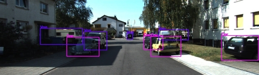

# TermProject-2021-ObjectDetection-KITTI  
## 1. Dataset Preparation    
- [KITTI dataset](https://drive.google.com/drive/folders/1f47HB5gLQDElIAf600SX-VtrX58i7SpU?usp=sharing)  
    - Training images  : 3000  
    - Validation images: 81  
    - Testing images   : 4481  

- Sample numbers of the training data with 8 classes:  

    |   Classes     |  Car   | Van|Truck|Walker|Sitter|Rider|Tram|Misc.|
    | ------------- |:------:|:--:|:---:|:----:|:----:|:---:|:--:|:---:|
    | Sample number |   11379|1197|  428|  1816|    93|  671| 208|  428|
    

## 2. Testing Result:
- ### YOLOv3 `AP: 32.7%`  

  - Mean average precision of each class:  
    |   Classes         |Car|  Van|Truck|Walker|Sitter|Rider|  Tram|Misc.|
    | ----------------- |:-:|:---:|:---:|:----:|:----:|:---:|:----:|:---:|
    | Average Precision |73%|35.9%|56.5%| 31.5%|    0%|30.5%| 33.8%| 0.3%|  
    
  - Performance:  

      
      
      
    
- ### YOLOv4 `AP: 43.8%`  

  - Mean average precision of each class:  
    |   Classes         |Car|  Van|Truck|Walker|Sitter|Rider|  Tram|Misc.|
    | ----------------- |:-:|:---:|:---:|:----:|:----:|:---:|:----:|:---:|
    | Average Precision |63.6%|63%|79%| 26.7%|   19.1%|40.1%| 57.5%| 50.2%|  
    
  - Performance:  

      
      
      

    
- ### Scaled YOLOv4 `AP: 47.6%`  

  - Mean average precision of each class:  
    |   Classes         |Car|  Van|Truck|Walker|Sitter|Rider|  Tram|Misc.|
    | ----------------- |:-:|:---:|:---:|:----:|:----:|:---:|:----:|:---:|
    | Average Precision |65.7%|60.9%|65.3%| 23.5%|   15.0%|60.4%| 62.9%| 59.1%|  
    
  - Performance:  
    
      
      
      
    
- ### SSD (VGG-300, pretrained model) `AP: 24%`  

  - Mean average precision of each class:  
    |   Classes         |Car|  Van|Truck|Walker|Sitter|Rider|  Tram|Misc.|
    | ----------------- |:-:|:---:|:---:|:----:|:----:|:---:|:----:|:---:|
    | Average Precision |59.6%|39.3%|29.9%| 9.1%| 0%|10.6%| 23.6%| 20.0%|  
    
  - Performance:  
    
      
      
      
    
- ### Faster RCNN (ResNet-101, pretrained model) `AP: 63.6%`  

  - Mean average precision of each class:  
    |   Classes         |Car|  Van|Truck|Walker|Sitter|Rider|  Tram|Misc.|
    | ----------------- |:-:|:---:|:---:|:----:|:----:|:---:|:----:|:---:|
    | Average Precision |80.0%|78.4%|86.3%| 57.8%| 16.5%|67.3%| 75.7%| 49.1%|  
    
  - Performance:  
    
      
      
      
    
- ### Mask RCNN (ResNet-101, pretrained model) `AP: 57.99%`  

  - Mean average precision of each class:  
    |   Classes         |Vehicle|  Person|
    | ----------------- |:-----:|:------:|
    | Average Precision |  75.1%|   45.0%|
    
  - Performance:  
    
      
      
      
    
## 3. Summary

- Performance Table:

    |   Method         |Total|Vehicle|Person|Run times| Enviroment|  
    | ---------------- |:---:|:-----:|:----:|:-------:|:---------:|  
    |               SSD|24.0%|  38.5%|  6.6%|    0.12s| GTX 1080ti|  
    |            YOLOv3|32.7%|  39.9%| 20.6%|     0.2s| GTX 1080ti|  
    |            YOLOv4|43.8%|  62.2%| 28.6%|    0.38s| GTX 1080ti|  
    |     Scaled VOLOv4|47.6%|  63.7%| 32.9%|    0.34s| GTX 1080ti|  
    |        Mask R-CNN|58.0%|  75.1%| 45.0%|       3s|TPU (Colab)|  
    |      Faster R-CNN|63.6%|  73.9%| 47.2%|       7s|GPU (Colab)|  
    
- Speed (ms) of processing 1 images versus accuracy (AP) on KITTI dataset:

      

## 4. [Final Term Project Report](https://drive.google.com/file/d/124NBMW1x0Y_Et5gJU92Qf7PXZcg0sI11/view?usp=sharing)
## 5. Contact me: qaz5517359@gmail.com
    
